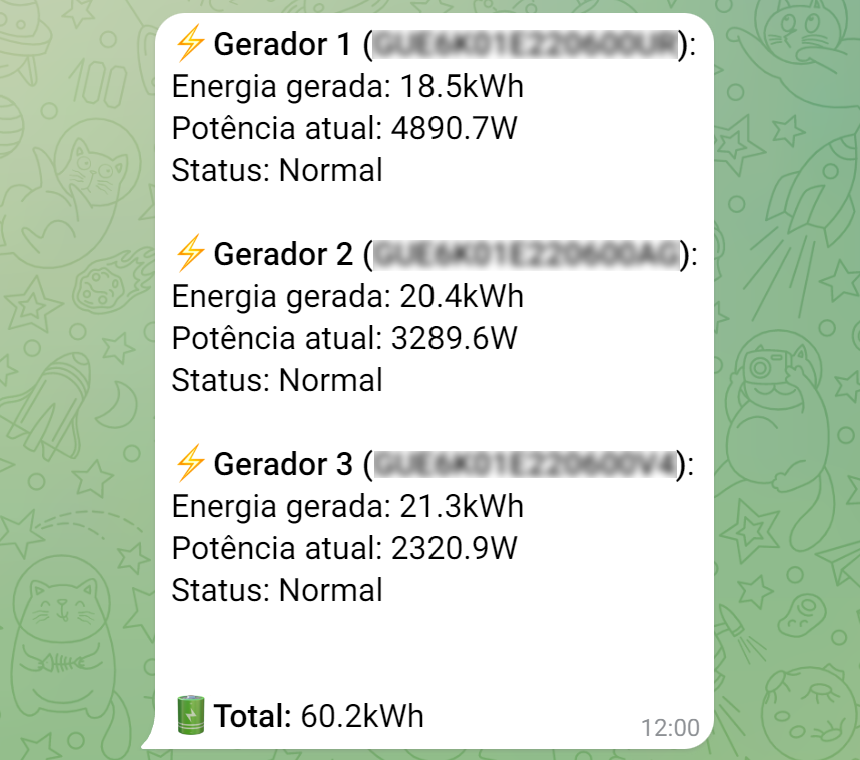

<p align="center">
    <a href="http://solar-monitoramento.intelbras.com.br" target="_blank"></a>
    <a href="https://laravel.com" target="_blank"></a>
</p>

## Intelbras Solar

A aplicação foi desenvolvida utilizando o framework [Laravel ](https://laravel.com/)com intuito básico de enviar as informações da energia gerada contidas no painel da [Intelbras Solar](http://solar-monitoramento.intelbras.com.br) através do [Telegram](https://telegram.org/).

<br>

## Instalação

1. Instale as dependências  
   `composer install`  
   <br>
2. Faça uma cópia do arquivo `.env-example` para `.env` e configure as variáveis de ambiente:

   ```apache
   # Token do BOT do Telegram
   TELEGRAM_BOT_TOKEN=

   # Id dos chats (separados por vírgula) para onde quer enviar
   TELEGRAM_CHAT_IDS=

   # Usuário da plataforma
   INTELBRAS_USER=

   # Senha da plataforma
   INTELBRAS_PASSWORD=

   # Id da planta de instalação (está como atributo value no menu superior esquerdo da plataforma)
   INTELBRAS_PLANT_ID=
   ```

<br>

## Comandos disponíveis

1. Envia status de cada estação da planta  
   `php artisan intelbras:verificar-geracao`  
   <br>
2. Envia quantidade total gerada no dia  
   `php artisan intelbras:total-gerado`  

<br>

## Rotinas  
Configurável em App\Console\Kernel

1. Das 9h às 18h enviar a cada hora o estado de cada estação  
2. Às 18h30 enviar o total gerado no dia  
   
Para habilitar a rotina, adicione a entrada abaixo no cron do seu servidor:  
`* * * * * cd /path-to-your-project && php artisan schedule:run >> /dev/null 2>&1`  
<br>

## Exemplo

  
<br>
  
## The MIT License (MIT)

Permission is hereby granted, free of charge, to any person obtaining a copy
of this software and associated documentation files (the "Software"), to deal
in the Software without restriction, including without limitation the rights
to use, copy, modify, merge, publish, distribute, sublicense, and/or sell
copies of the Software, and to permit persons to whom the Software is
furnished to do so, subject to the following conditions:

The above copyright notice and this permission notice shall be included in
all copies or substantial portions of the Software.

THE SOFTWARE IS PROVIDED "AS IS", WITHOUT WARRANTY OF ANY KIND, EXPRESS OR
IMPLIED, INCLUDING BUT NOT LIMITED TO THE WARRANTIES OF MERCHANTABILITY,
FITNESS FOR A PARTICULAR PURPOSE AND NONINFRINGEMENT. IN NO EVENT SHALL THE
AUTHORS OR COPYRIGHT HOLDERS BE LIABLE FOR ANY CLAIM, DAMAGES OR OTHER
LIABILITY, WHETHER IN AN ACTION OF CONTRACT, TORT OR OTHERWISE, ARISING FROM,
OUT OF OR IN CONNECTION WITH THE SOFTWARE OR THE USE OR OTHER DEALINGS IN
THE SOFTWARE.
